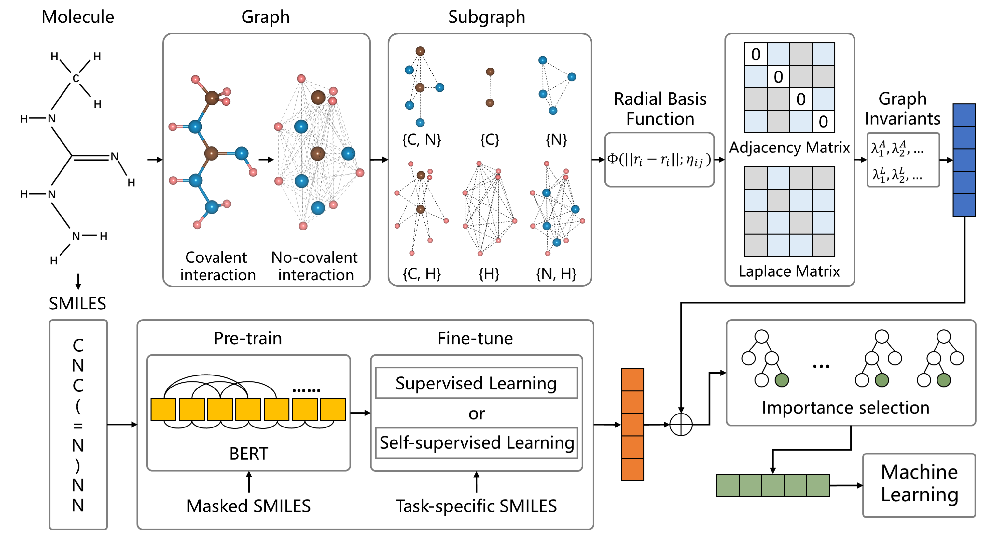

# Algebraic Graph-assisted Bidirectional Transformers (AGBT)

Implementation of the paper "Algebraic Graph-assisted Bidirectional Transformers for Molecular Prediction" by Dong Chen, Kaifu Gao, Duc Duy Nguyen, Xin Chen, Yi Jiang, Guo-Wei Wei<sup>+</sup> and Feng Pan\*

---



---

## Requirments

OS Requirements
- CentOS Linux 7 (Core)

Python Dependencies
- setuptools (>=18.0)
- python (>=3.7)
- pytorch (>=1.2)
- rdkit (2020.03)
- biopandas (0.2.7)
- numpy (1.17.4)
- scikit-learn (0.23.2)
- scipy (1.5.2)
- pandas (0.25.3)


## Installation Guide

Install from Github

```shell
git clone https://github.com/ChenDdon/AGBTcode.git
cd AGBTcode/agbt_pro
python setup.py build_ext --inplace
```

which should install in about 60 seconds.

## Downloading Models

Pre-trained model, self-supervised fine-tuned model, and supervised fine-tuned model are publicly available.

```shell
# Pre-trained model
wget https://weilab.math.msu.edu/AGBT_Source/checkpoint_pretrained.pt ./examples/models/
# Self-supervised learning (SSL) fine-tuned model for toxicity
wget https://weilab.math.msu.edu/AGBT_Source/checkpoint_ssl_finetuned_4toxicity.pt ./examples/models/
# Sequential supervied learning (SL) fine-tuned model for toxicity
wget https://weilab.math.msu.edu/AGBT_Source/checkpoint_sl_finetuned_4toxicity.pt ./examples/models/
# Self-supervised learning (SSL) fine-tuned model for logP
wget https://weilab.math.msu.edu/AGBT_Source/checkpoint_ssl_finetuned_logp.pt ./examples/models/
# Sequential supervied learning (SL) fine-tuned model for logP
wget https://weilab.math.msu.edu/AGBT_Source/checkpoint_sl_finetuned_logp.pt ./examples/models/
```

## Reproduction instructions

- The generated AGBT-FPs are avaliable at https://weilab.math.msu.edu/AGBT_Source/AGBT_FPs.tar.gz.

```shell
wget https://weilab.math.msu.edu/AGBT_Source/AGBT_FPs.tar.gz
```

- The one of trained task-specific neural network-based model can be downloaded from https://weilab.math.msu.edu/AGBT_Source/downstream_nn_models.tar.gz. The GBDT model can be obtained within 10 minutes, and the specific parameters are shown in the "AGBT model parametrization" section (Table S3) of the Supporting Information. (Each dataset should be repeated 20 times applying different random numbers, so each dataset corresponds to 20 models.)

```shell
wget https://weilab.math.msu.edu/AGBT_Source/downstream_nn_models.tar.gz
```

- All parameter settings for the training process can be referred to the "AGBT model parametrization" section in Supporting Information.

## Customize a task-specific AGBT-FPs

For users who want to build a new task-specific model from a set of molecules with corresponding properties, here we provide some scripts for generating AG-FPs, BT-FPs, and AGBT-FPs, respectively. By default, we use supervised learning-based strategy to fine-tune the pre-trained model. The example molecule includes the MOL2 file and the corresponding SMILES string. The following steps need to be performed on a platform that supports GPU computing.

```shell
# Generate Bidirectional Transformer-based Fingerprints (BT-FPs)

# step 1, download the pre-trained model
wget https://weilab.math.msu.edu/AGBT_Source/checkpoint_pretrained.pt ./examples/models/

# step 2, pre-process input data (Binarize the input data to speed up the training.)
python "./agbt_pro/preprocess.py" --only-source --trainpref "./examples/data/example_train_canonical.smi" --validpref "./examples/data/example_valid_canonical.smi" --destdir "./examples/data/input0/" --trainoutf "train" --validoutf "valid"  --workers 20 --file-format smiles --srcdict "./examples/data/input0/dict.txt"

# step 3, fine-tuning the pre-trained model
python "./agbt_pro/train.py" "./examples/data/" --save-dir "./examples/models/" --train-subset train --valid-subset valid --restore-file "./examples/models/checkpoint_pretrained.pt" --task sentence_prediction --num-classes 1 --regression-target --init-token 0 --best-checkpoint-metric loss --arch roberta_base --bpe smi --encoder-attention-heads 8 --encoder-embed-dim 512 --encoder-ffn-embed-dim 1024 --encoder-layers 8 --dropout 0.1 --attention-dropout 0.1  --criterion sentence_prediction --max-positions 256 --truncate-sequence --skip-invalid-size-inputs-valid-test --optimizer adam --adam-betas '(0.9,0.999)' --adam-eps 1e-6 --clip-norm 0.0 --lr-scheduler polynomial_decay --lr 0.0001 --warmup-updates 500 --total-num-update 5000 --weight-decay 0.1 --max-update 5000 --log-format simple --reset-optimizer --reset-dataloader --reset-meters --no-epoch-checkpoints --no-last-checkpoints --no-save-optimizer-state --find-unused-parameters --log-interval 50 --max-sentences 64 --update-freq 2 --required-batch-size-multiple 1 --ddp-backend no_c10d --fp16 --max-epoch 5000

# step 4, generate BT-FPs
python "./agbt_pro/generate_bt_fps.py" --model_name_or_path "./examples/models/" --checkpoint_file "checkpoint.pt" --data_name_or_path  "./examples/data/" --dict_file "./example/data/dict.txt" --target_file "./examples/data/example_train_canonical.smi" --save_feature_path "./examples/BT_FPs/examples_bt_train_features.npy"
python "./agbt_pro/generate_bt_fps.py" --model_name_or_path "./examples/models/" --checkpoint_file "checkpoint.pt" --data_name_or_path  "./examples/data/" --dict_file "./example/data/dict.txt" --target_file "./examples/data/example_valid_canonical.smi" --save_feature_path "./examples/BT_FPs/examples_bt_valid_features.npy"
```

```shell
## Generate Algebraic Graph-based Fingerprints (AG-FPs)

# step 1. Laplacian, Lorentz
python "./ag_pro/AG_main.py" --dataset_prefix 'example_train' --dataset_path './examples/data/example_train_x_mol2' --dataset_id_path './examples/data/example_train.id' --save_feature_path_prefix './examples/AG_FPs' --matrix_type 'Lap' --kernal_type 'Lorentz' --kernal_tau 0.5 --kernal_parameter 10.0
python "./ag_pro/AG_main.py" --dataset_prefix 'example_valid' --dataset_path './examples/data/example_valid_x_mol2' --dataset_id_path './examples/data/example_valid.id' --save_feature_path_prefix './examples/AG_FPs' --matrix_type 'Lap' --kernal_type 'Lorentz' --kernal_tau 0.5 --kernal_parameter 10.0
# step 2. Laplacian, Exponential
python "./ag_pro/AG_main.py" --dataset_prefix 'example_train' --dataset_path './examples/data/example_train_x_mol2' --dataset_id_path './examples/data/example_train.id' --save_feature_path_prefix './examples/AG_FPs' --matrix_type 'Lap' --kernal_type 'Exponential' --kernal_tau 0.5 --kernal_parameter 20.0
python "./ag_pro/AG_main.py" --dataset_prefix 'example_valid' --dataset_path './examples/data/example_valid_x_mol2' --dataset_id_path './examples/data/example_valid.id' --save_feature_path_prefix './examples/AG_FPs' --matrix_type 'Lap' --kernal_type 'Exponential' --kernal_tau 0.5 --kernal_parameter 20.0
```

```shell
## Generate algebraic graph-assisted bidirectional transformer-based Fingerprints (AGBT-FPs)
python "./agbt_pro/feature_analysis.py" --train_x_f1 "./example/AG_FPs/example_train_Lap_Lorentz_10.0_tau_0.5.npy" --train_x_f2 "./example/AG_FPs/example_train_Lap_Exponential_20.0_tau_0.5.npy" --train_x_f3 "./example/BT_FPs/examples_bt_valid_features.npy" --train_y "./example/example_train_y.npy" --test_x_f1 "./example/AG_FPs/example_valid_Lap_Lorentz_10.0_tau_0.5.npy" --test_x_f2 "./example/AG_FPs/example_valid_Lap_Exponential_20.0_tau_0.5.npy" --test_x_f3 "./example/BT_FPs/examples_bt_valid_features.npy" --test_y "./example/logp_FDA_label.npyexample_valid_y.npy" --features_norm --save_folder_path "./example/AGBT-FPs/" --n_estimators 10000 --n_workers -1 --max_depth 7 --min_samples_split 3 --random_seed 1234 --n_select_features 512
```

For the data in the example, the entire process took less than 40 minutes.

## License

All codes released in this study under the MIT License.
