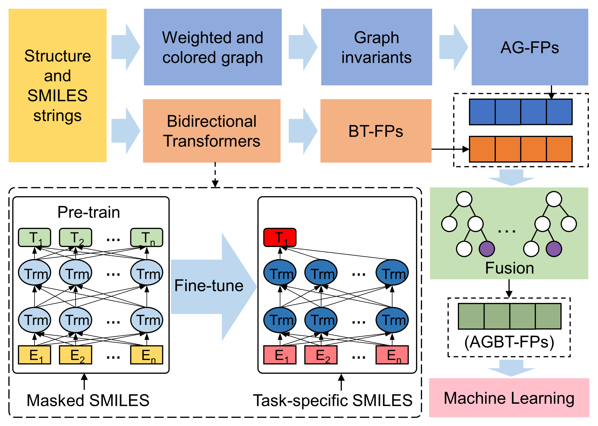

# Algebraic Graph-assisted Bidirectional Transformers (AGBT)

Implementation of the paper "Algebraic Graph-assisted Bidirectional Transformers for Toxicity Prediction" by Dong Chen, Kaifu Gao, Duc Duy Nguyen, Xin Chen, Yi Jiang, Guo-Wei Wei<sup>+</sup> and Feng Pan\*

---



---

## Requirments

```ssh
setuptools>=18.0
python>=3.7
pytorch>=1.2
numpy
rdkit
scikit-learn
biopandas
```

## Setup

Download the 'agbt_pro' and build some necessary modules.

```shell
cd agbt_pro
python setup.py build_ext --inplace
```

## Downloading Models

Pre-trained model, self-supervised fine-tuned model, and supervised fine-tuned model are publicly available.

```shell
# Pre-trained model
wget https://weilab.math.msu.edu/checkpoint_pretrained.pt ./examples/models/
# SSL fine-tuned model
wget https://weilab.math.msu.edu/checkpoint_ssl_finetuned.pt ./examples/models/
# Sequential fine-tuned model
wget https://weilab.math.msu.edu/checkpoint_sequential_sl_finetuned.pt ./examples/models/
```

## Generate Bidirectional Transformer-based Fingerprints (BT-FPs)

```shell

# example
python ./agbt_pro/generate_bt_fps.py --model_name_or_path ./examples/models/ --checkpoint_file checkpoint_ssl_finetuned.pt --data_name_or_path  ./examples/data/ --dict_file ./example/data/dict.txt --target_file ./examples/data/example.smi --save_feature_path ./examples/BT_FPs/examples_bt_features.npy
```

## Generate Algebraic Graph-based Fingerprints (AG-FPs)

```shell
# Laplacian, Lorentz
python ./ag_pro/AG_main.py --dataset_prefix 'example_data' --dataset_path './examples/data/example_mol2' --dataset_id_path './examples/data/example_stru.id' --save_feature_path_prefix './examples/AG_FPs' --matrix_type 'Lap' --kernal_type 'Lorentz' --kernal_tau 0.5 --kernal_parameter 10.0
# Laplacian, Exponential
python ./ag_pro/AG_main.py --dataset_prefix 'example_data' --dataset_path './examples/data/example_mol2' --dataset_id_path './examples/data/example_stru.id' --save_feature_path_prefix './examples/AG_FPs' --matrix_type 'Lap' --kernal_type 'Exponential' --kernal_tau 0.5 --kernal_parameter 20.0
```

